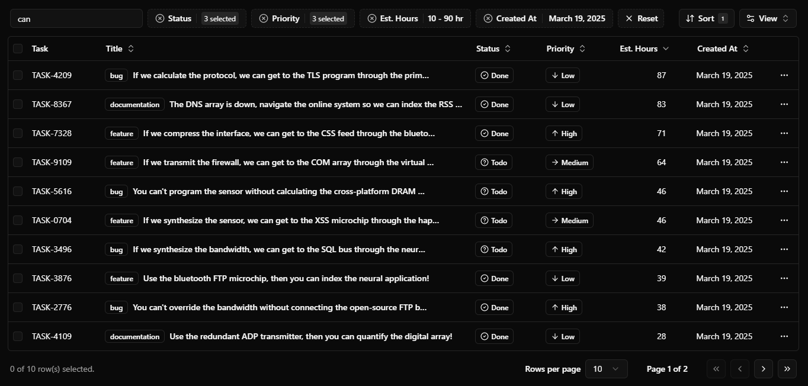

# [CENSUS]

This is a shadcn table component with server-side sorting, filtering, and pagination. It is bootstrapped with `create-t3-app`.

[](https://github.com/Mattykim87/CENSUS)

## Documentation

See the [documentation](https://diceui.com/docs/components/data-table) to get started.

## Tech Stack

- **Framework:** [Next.js](https://nextjs.org)
- **Styling:** [Tailwind CSS](https://tailwindcss.com)
- **UI Components:** [shadcn/ui](https://ui.shadcn.com)
- **Table package:** [TanStack/react-table](https://tanstack.com/table/latest)
- **Primary Database:** [Supabase PostgreSQL](https://supabase.com)
- **ORM:** [Drizzle ORM](https://orm.drizzle.team)
- **Authentication:** [Supabase Auth](https://supabase.com/auth)
- **Validation:** [Zod](https://zod.dev)

## Features

- [x] Server-side pagination, sorting, and filtering
- [x] Customizable columns
- [x] Auto generated filters from column definitions
- [x] Dynamic `Data-Table-Toolbar` with search, filters, and actions
- [x] `Notion/Airtable` like advanced filtering
- [x] `Linear` like filter menu for command palette filtering
- [x] Action bar on row selection
- [x] Supabase authentication integration
- [x] Secure database access via Supabase

## Running Locally

1. Clone the repository

   ```bash
   git clone https://github.com/Mattykim87/CENSUS
   ```

2. Install dependencies using pnpm

   ```bash
   pnpm install
   ```

3. Copy the `.env.example` to `.env` and update the variables.

   ```bash
   cp .env.example .env
   ```

   > **Note:** Set up your Supabase project and add your Supabase credentials to the `.env` file. See [Supabase Setup](./docs/supabase-setup.md) for detailed instructions.

4. Database setup options:
   
   **Primary Option: Supabase (recommended)**
   - Create a Supabase project (our primary database provider)
   - Add your Supabase credentials to .env
   - See [Supabase Setup](./docs/supabase-setup.md) for detailed instructions
   
   **Alternative Option: Docker (for local development only)**
   ```bash
   docker compose up
   ```
   > **Note:** Docker setup lacks Supabase Auth and other Supabase-specific features. Use only for basic local development.

5. Push the database schema

   ```bash
   pnpm run db:push
   ```

6. Seed the database

   ```bash
   pnpm run db:seed
   ```

7. Start the development server

   ```bash
   pnpm run dev
   ```

## How do I deploy this?

### Vercel Deployment

1. Push your code to GitHub
2. Import your project into Vercel
3. Add the required environment variables:
   - `DATABASE_URL` (Supabase PostgreSQL connection string)
   - `NEXT_PUBLIC_SUPABASE_URL` (Supabase project URL)
   - `NEXT_PUBLIC_SUPABASE_ANON_KEY` (Supabase anon key)
4. Deploy!

See the [deployment guides](https://create.t3.gg/en/deployment/vercel) and [Supabase Setup](./docs/supabase-setup.md) for more detailed instructions.

Alternate deployment options: [Netlify](https://create.t3.gg/en/deployment/netlify) and [Docker](https://create.t3.gg/en/deployment/docker).

## Credits

- [shadcn/ui](https://github.com/shadcn-ui/ui/tree/main/apps/www/app/(app)/examples/tasks) - For the initial implementation of the data table.
